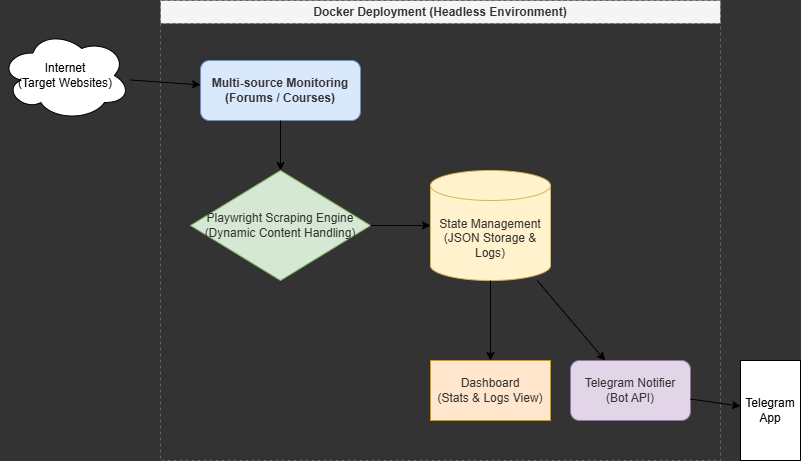
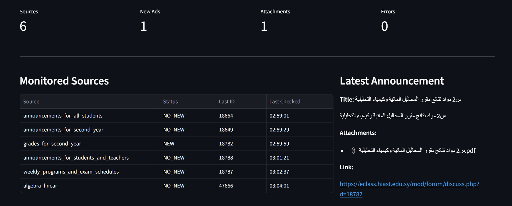
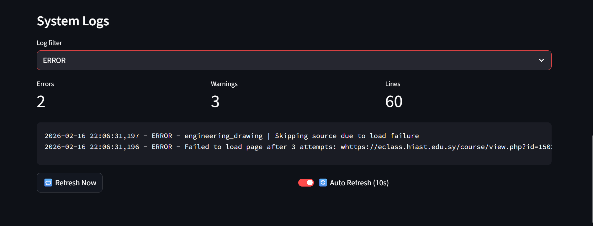
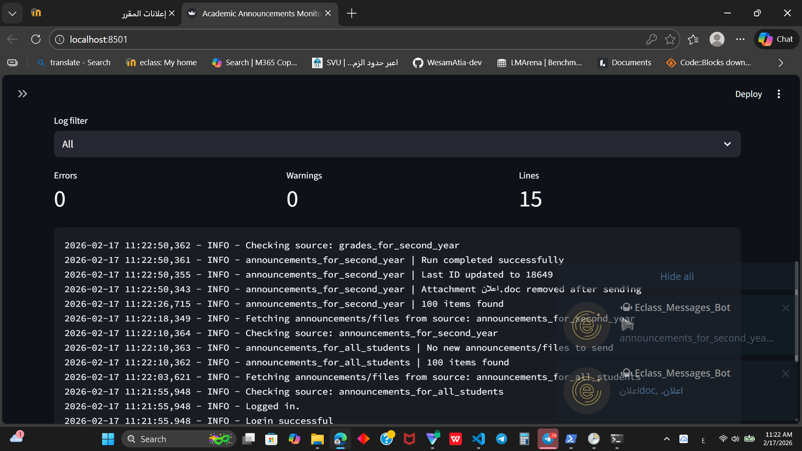

\# Smart Ads Monitoring System

\## Overview

Smart Ads Monitoring System is designed to help students and users track new ads on multiple sources in real-time. 
It ensures that no ad is missed by checking each source frequently and sending instant Telegram notifications.

\## Features

- **Forum/Course Page Detection:** Supports different page types (UP/DOWN pages) and dynamically identifies new posts.  
- **Multi-source Monitoring:** Easily add multiple sources without changing core logic.  
- **Telegram Notifications:** Instantly sends new ad notifications with attachments.  
- **Dockerized Deployment:** Run the system easily on any server with Docker.  
- **Dashboard Overview:** Visualizes logs and statistics in a simple Streamlit interface.

\## Architecture Diagram

The diagram shows how the scraping engine interacts with the system:
1. Playwright fetches ads from multiple sources.
2. New ads are stored in the state (JSON files) for the Dashboard.
3. Telegram notifications are sent immediately without waiting for storage.

\## Screenshots

### Dashboard

Shows the latest stats of monitored sources and recent ads.

### Logs

Displays the last 300 log entries with filtering options.

\## Challenges Solved

- **Reliable detection of new ads:** The system ensures no duplicate or missed ads.  
- **Duplicate prevention:** Each ad is checked against `last_id.json` before sending.  
- **Handling dynamic content:** Uses Playwright to handle JavaScript-heavy pages.  
- **UP/DOWN page support:** Detects ads on both normal (UP) and disabled (DOWN) pages.  
- **Attachment handling:** Sends single/multiple files or fallback links to Telegram.

